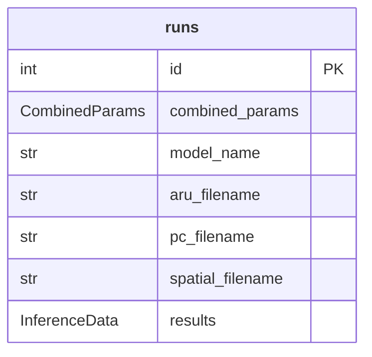

```mermaid
erDiagram
    __runs__ {
        int id PK
        CombinedParams combined_params
        str model_name
        str aru_filename
        str pc_filename
        str spatial_filename
        InferenceData results
    }
```