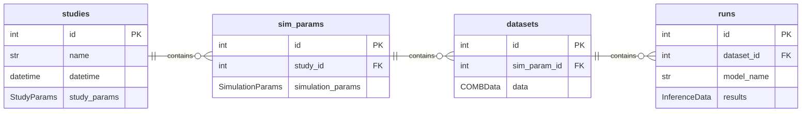

Here are the tables:
- studies: (id, datetime, name, study_params)
- datasets: (id, study_id, SimulationParams, data [stored on disk])
- runs: (id, dataset_id, model_name, results [stored on disk])

